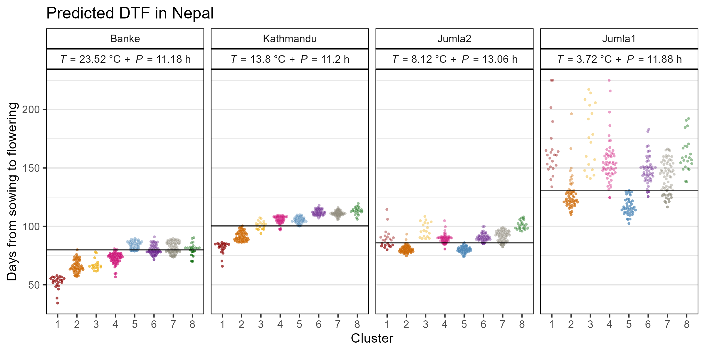

```{r setup, include=FALSE}
knitr::opts_chunk$set(echo = TRUE)
```

\pagebreak

---

[Sandesh Neupane, Rajeev Dhakal, Derek Wright, Deny Shrestha, Bishnu Dhakal and Kirstin Bett. (2021) **Strategic Identification of New Genetic Diversity to Expand Lentil (*Lens culinaris* Medik.) Production (Using Nepal as an Example)**. *Agronomy*. 11(10): 1933.](https://doi.org/10.3390/agronomy11101933)

which is a follow-up to:

[Derek Wright, Sandesh Neupane, Taryn Heidecker, Teketel Haile, Clarice Coyne, Rebecca McGee, Sripada Udupa, Fatima Henkrar, Eleonora Barilli, Diego Rubiales, Tania Gioia, Giuseppina Logozzo, Stefania Marzario, Reena Mehra, Ashutosh Sarker, Rajeev Dhakal, Babul Anwar, Debashish Sarker, Albert Vandenberg, and Kirstin Bett. (2020) **Understanding photothermal interactions can help expand production range and increase genetic diversity of lentil (*Lens culinaris* Medik.)**. *Plants, People, Planet*. 00:1-11.](https://doi.org/10.1002/ppp3.10158)

https://github.com/derekmichaelwright/AGILE_LDP_Phenology

---

https://github.com/derekmichaelwright/AGILE_LDP_Nepal

[View as pdf](https://github.com/derekmichaelwright/AGILE_LDP_Nepal/raw/master/README.pdf) 

[View as HTML](https://derekmichaelwright.github.io/AGILE_LDP_Nepal/README.html)

[Source Code Vignette (Phenology_Vignette.html)](https://derekmichaelwright.github.io/AGILE_LDP_Nepal/Phenology_Vignette.html)

# AGILE Project


---

# Figure 1


---

# Figure 2



---

# Figure 3

https://derekmichaelwright.github.io/AGILE_LDP_Nepal/Figure_03.html


---

# Figure 4


---

# model_nepal.csv

https://raw.githubusercontent.com/derekmichaelwright/AGILE_LDP_Nepal/master/model_nepal.csv

---

&copy; Derek Michael Wright