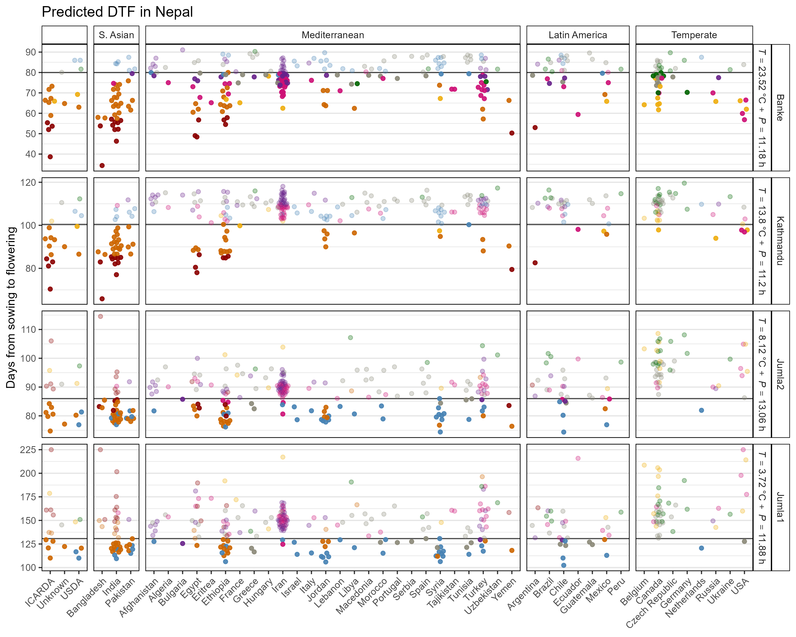

Strategic Identification of New Genetic Diversity to Expand Lentil
(*Lens culinaris* Medik.) Production (Using Nepal as an Example)
================
Derek Michael Wright <derek.wright@usask.ca>
27-09-2021

------------------------------------------------------------------------

[Sandesh Neupane, Rajeev Dhakal, Derek M. Wright, Deny K. Shrestha,
Bishnu Dhakal and Kirstin E. Bett. **Strategic Identification of New
Genetic Diversity to Expand Lentil (*Lens culinaris* Medik.) Production
(Using Nepal as an Example)**. *Agronomy*. (**2021**) 11(10): 1933.
doi.org/10.3390/agronomy11101933](https://doi.org/10.3390/agronomy11101933)

which is a follow-up to:

[Derek M. Wright, Sandesh Neupane, Taryn Heidecker, Teketel A. Haile,
Crystal Chan, Clarice J. Coyne, Rebecca J. McGee, Sripada Udupa, Fatima
Henkrar, Eleonora Barilli, Diego Rubiales, Tania Gioia, Giuseppina
Logozzo, Stefania Marzario, Reena Mehra, Ashutosh Sarker, Rajeev Dhakal,
Babul Anwar, Debashish Sarker, Albert Vandenberg & Kirstin E. Bett
**Understanding photothermal interactions can help expand production
range and increase genetic diversity of lentil (*Lens culinaris*
Medik.)**. *Plants, People, Planet*. (**2020**) 00:1-11.
doi.org/10.1002/ppp3.10158](https://doi.org/10.1002/ppp3.10158)

<https://github.com/derekmichaelwright/AGILE_LDP_Phenology>

------------------------------------------------------------------------

<https://github.com/derekmichaelwright/AGILE_LDP_Nepal>

[View as
pdf](https://github.com/derekmichaelwright/AGILE_LDP_Nepal/raw/master/README.pdf)

[View as
HTML](https://derekmichaelwright.github.io/AGILE_LDP_Nepal/README.html)

[Source Code Vignette
(Phenology_Vignette.html)](https://derekmichaelwright.github.io/AGILE_LDP_Nepal/Phenology_Vignette.html)

# AGILE Project

------------------------------------------------------------------------

# Figure 1

------------------------------------------------------------------------

# Figure 2

------------------------------------------------------------------------

# Figure 3

------------------------------------------------------------------------

# Figure 4

<https://derekmichaelwright.github.io/AGILE_LDP_Nepal/Figure_04.html>

------------------------------------------------------------------------

# model_nepal.csv

<https://raw.githubusercontent.com/derekmichaelwright/AGILE_LDP_Nepal/master/model_nepal.csv>

------------------------------------------------------------------------

© Derek Michael Wright
